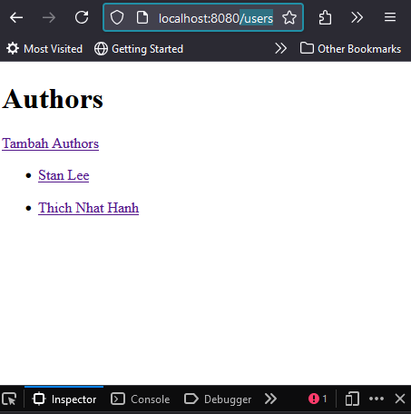

# Impementasi Relasi Database MongoDB di Express, Mongoose

## Tentang Kelas

Panduan untuk mempelajari Panduan untuk mempelajari implementasi relasi database MongoDB di Express, Mongoose

## Target dan Sasaran Siswa

Kelas ini cocok untuk:

- Kelas ditujukan bagi mereka yang tertarik untuk mempelajari Panduan untuk mempelajari implementasi relasi database MongoDB di Express, Mongoose
- Siswa harus bisa belajar mandiri. Karena pada kelas ini siswa harus mengatur jadwal belajarnya sendiri.

## Tujuan Umum dan Khusus Pelatihan

- **Tujuan Umum**: Di akhir kelas, siswa dapat memahami Panduan untuk mempelajari implementasi relasi database MongoDB di Express, Mongoose
- **Silabus**: Memahami Panduan untuk mempelajari implementasi relasi database MongoDB di Express, Mongoose

### Metode Ajar Online Self-paced Learning Siswa dapat menentukan sendiri waktu belajarnya

## Silabus

1. **Membuat Model Untuk Contoh Author Dan Postingannya** _(05:08)_
2. **Membuat Halaman Index Dan Membuat Data User** _(06:19)_
3. **Menampilkan Data User dan Tampilannya** _(03:44)_
4. **Menyimpan Sebuah Data Post Ke-Model User** _(07:17)_
5. **Menampilkan Data Post di Tampilkan Detail User** _(05:50)_
6. **Menampilkan Data User Di Halaman Detail Post** _(02:45)_
7. **Memanfaatkan Middleware Schema Untuk Menghapus Data** _(06:60)_

## Screenshot

```js
app.get("/users", async (req, res) => {
  const dataUser = await User.find();
  res.render("users/index", {
    title: "Index User",
    dataUser,
  });
});

```
